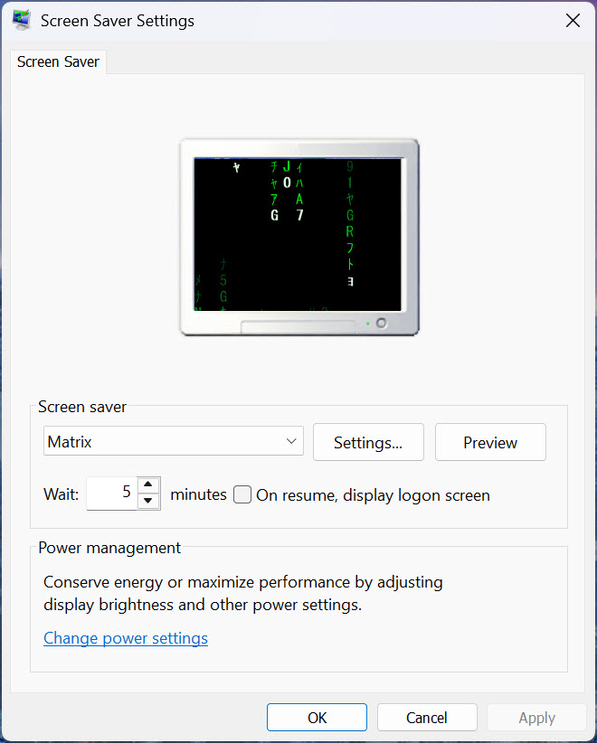

# Matrix Screensaver

A Windows screensaver that recreates the digital rain effect from *The Matrix*. Written in C# / WinForms (.NET 9) with GDI+ rendering.



## Features

- Classic green digital rain: half-width katakana, digits, and Latin characters
- Bright white-green "head" glyph with a fading green trail
- Multi-monitor support (one window per display)
- Per-monitor DPI aware: runs at each screen's native resolution
- Proper Windows screensaver integration, supporting `/s` (run), `/p <hwnd>` (preview), and `/c` (config)
- Exits on mouse move, click, or keypress
- Works when Windows idle-locks your PC (with "On resume, display logon screen" enabled)

## Build

Requires the .NET 9 SDK.

```powershell
dotnet publish -c Release -r win-x64 --self-contained true `
  -p:PublishSingleFile=true `
  -p:IncludeNativeLibrariesForSelfExtract=true `
  -p:EnableCompressionInSingleFile=true `
  -o publish
```

Produces a single self-contained `publish\MatrixScreensaver.exe` (~50 MB).

## Install

Copy the built exe to a folder as `Matrix.scr` and point Windows at it.

```powershell
$dest = "$env:LOCALAPPDATA\MatrixScreensaver"
New-Item -ItemType Directory -Force -Path $dest | Out-Null
Copy-Item .\publish\MatrixScreensaver.exe (Join-Path $dest "Matrix.scr") -Force

$rk = "HKCU:\Control Panel\Desktop"
Set-ItemProperty $rk "SCRNSAVE.EXE"        (Join-Path $dest "Matrix.scr")
Set-ItemProperty $rk "ScreenSaveActive"    "1"
Set-ItemProperty $rk "ScreenSaveTimeOut"   "300"   # seconds of idle before triggering
Set-ItemProperty $rk "ScreenSaverIsSecure" "1"     # require login on resume
```

Apply immediately without a reboot:

```powershell
Add-Type '
using System; using System.Runtime.InteropServices;
public class SPI {
  [DllImport("user32.dll")] public static extern bool SystemParametersInfo(uint u, uint p, IntPtr v, uint f);
}'
[SPI]::SystemParametersInfo(17, 1,   [IntPtr]::Zero, 3) | Out-Null  # SPI_SETSCREENSAVEACTIVE
[SPI]::SystemParametersInfo(15, 300, [IntPtr]::Zero, 3) | Out-Null  # SPI_SETSCREENSAVETIMEOUT
```

## Usage

Open the Screen Saver dialog:

```powershell
control desk.cpl,,@screensaver
```

Select **Matrix**. Use **Preview** for full screen. Set the idle timeout there or with the registry command above.

Command-line args (same as any `.scr`):

| Arg | Behavior |
| --- | --- |
| `/s` | Run full screen (default) |
| `/p <hwnd>` | Render embedded in the Screen Saver dialog preview |
| `/c` | Show a config message box (no options to configure) |

## Files

- `Program.cs`: entry point, parses `/s` `/p` `/c`
- `MatrixForm.cs`: per-screen form plus the `MatrixRain` rendering engine
- `app.manifest`: requested execution level (`asInvoker`)
- `MatrixScreensaver.csproj`: project file (targets `net9.0-windows`, per-monitor-v2 DPI via `ApplicationHighDpiMode`)
- `.gitignore`: excludes build output (`bin/`, `obj/`, `publish/`)
- `LICENSE`: MIT license text

## Notes on locking

Windows runs the screensaver over the active session after the idle timeout. With `ScreenSaverIsSecure = 1`, dismissing the screensaver takes you to the login prompt, effectively locking. If you press **Win+L** manually, Windows shows the lock screen image instead of the screensaver (an OS limitation, not fixable from a `.scr`). A `SessionLock` scheduled task could launch the screensaver on manual lock if you want that behavior.

## Performance

Rendering uses GDI+ (`Graphics.DrawString`) with cached brushes and a per-frame alpha fade overlay for the trail effect. It runs at ~20 FPS, which is plenty for the effect and light on CPU.

## License

Released under the [MIT License](LICENSE). Copyright (c) 2026 Jeremiah Isaacson.

## Trademark

*The Matrix* and its "digital rain" motif are the creative works and trademarks of Warner Bros. Entertainment Inc. This project is an independent, fan-made homage. It is not affiliated with, endorsed by, or sponsored by Warner Bros.
